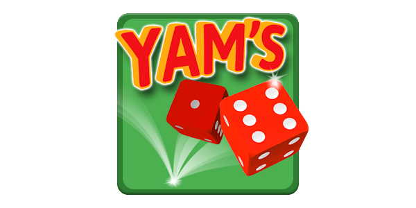

<!-- PROJECT LOGO -->
<h1 align="center">Yams</h1>

  

# Présentation du projet

Ceci est une application de jeu de Yams développée en Python. Le Yams, également connu sous le nom de Yahtzee, est un jeu de dés dans lequel les joueurs doivent obtenir certaines combinaisons en lançant des dés.

# Fonctionnalités

- L'application permet à un joueur de jouer au jeu de Yams en lançant des dés et en marquant des points pour différentes combinaisons.
- Les règles du jeu sont respectées et les points sont calculés automatiquement en fonction des dés lancés.
- L'application indique au joueur les combinaisons possibles à chaque tour pour faciliter la décision.

# Réalisé avec :

* Python
